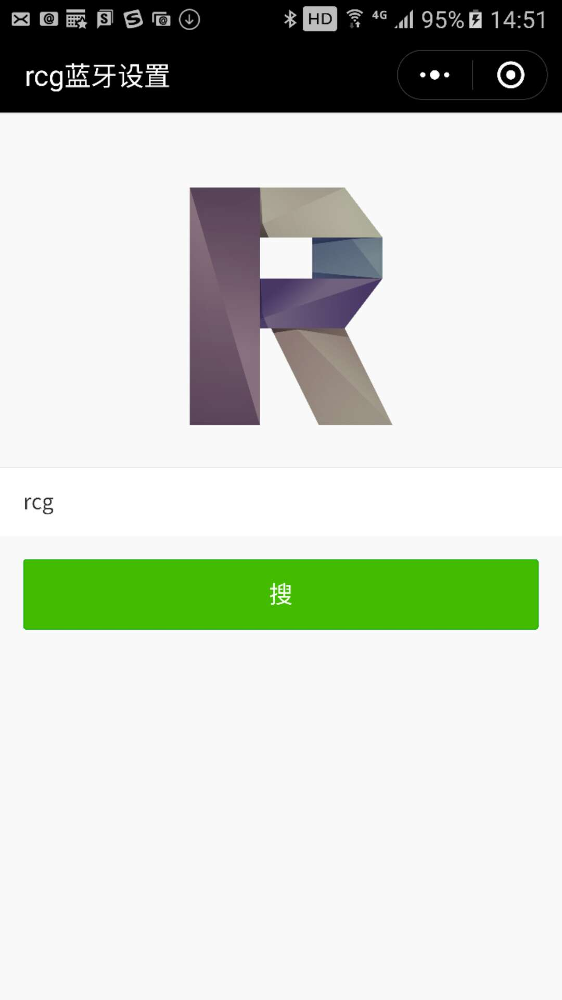
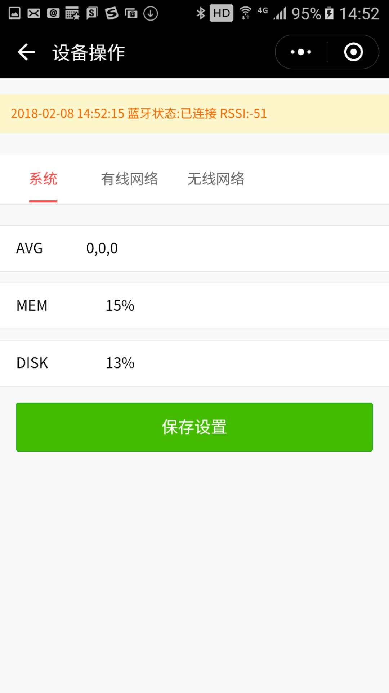
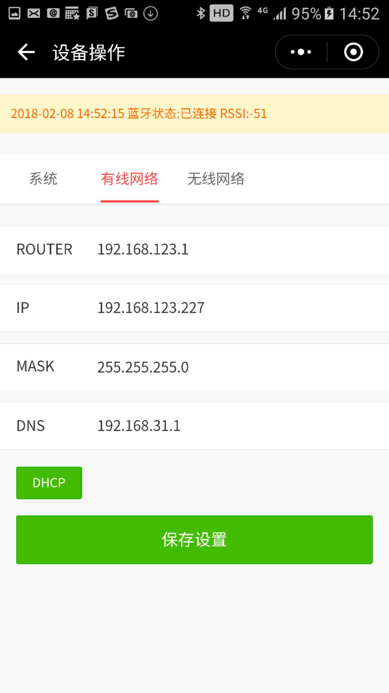
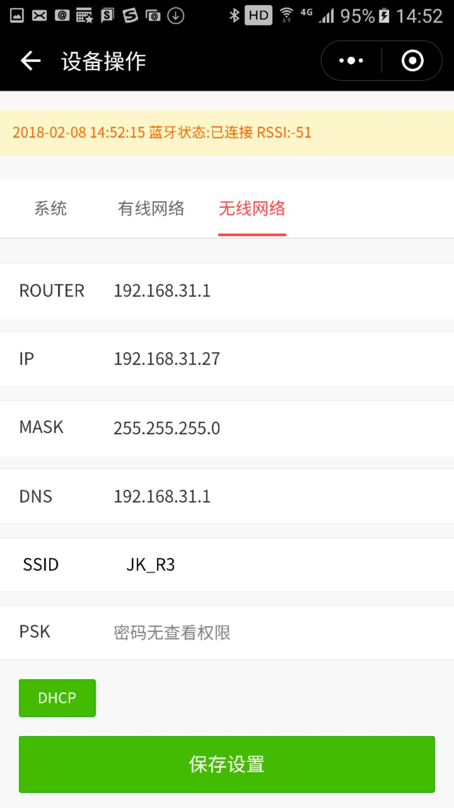
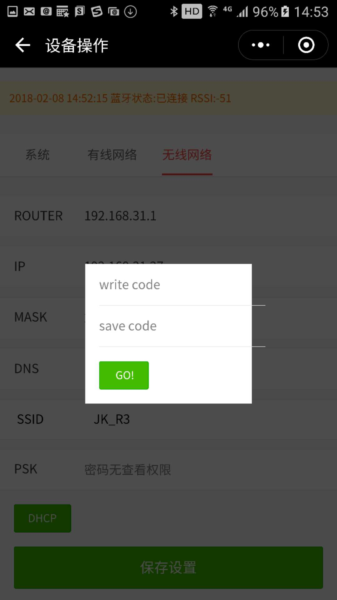

# rcg-setup-service
为树莓派设置网络及获取系统相关参数的服务(建立ble周边设备服务,通过微信小程序建立连接进行读写操作)
## 背景
> &emsp;&emsp;在树莓派安装部署的过程中,我想很多人都遇到过不堪回首的经历,就是如何设置ip,各种显示器、鼠标、键盘、网线、路由器等乱入,百废待兴,依依东望．</br>
　　直到有一天看到家中的扫地机器人通过蓝牙的方式将wifi帐号密码植入,何等潇洒,于是效法之．从此以后,手机在手,策马奔腾,手机不在手,策别人马奔腾.
## 依赖

### Raspbian(未在其他系统上测试过)

 * Kernel version 3.6 or above
 * ```libbluetooth-dev```
 * ```bluetoothd``` disabled, if BlueZ 5.14 or later is installed. Use ```sudo hciconfig hci0 up``` to power Bluetooth adapter up after stopping or disabling ```bluetoothd```.
    * ```System V```:
      * ```sudo service bluetooth stop``` (once)
      * ```sudo update-rc.d bluetooth remove``` (persist on reboot)
    * ```systemd```
      * ```sudo systemctl stop bluetooth``` (once)
      * ```sudo systemctl disable bluetooth```(persist on reboot)
 * ```nodejs```
 * ```typeScript```
 * ```pm2```
 * ```bleno```          

```sh
sudo apt-get install bluetooth bluez libbluetooth-dev libudev-dev
```
## 安装
```sh
cd rcg-setup-service
npm install -g typescript pm2
pm2 startup
npm install
tsc
```
## 运行
推荐用pm2守护,因为树莓派3设置静态ip,修改```/etc/dhcpcd.conf```文件后需重启设备才生效,不知道是不是还有不重启的方法?
### pm2.json
```javascript
{
  "apps":[
    {
      "name":"rcg-setup-service",
      "script":"dist/index.js"
    }
  ]
}
```
```sh
pm2 start pm2.json
pm2 save
```

## 微信小程序
### 使用方法
微信 -> 发现 -> 小程序 -> 搜索(rcgSetting)
### 效果







### Tips
1. 树莓派上绑定的蓝牙设备名称默认为前缀```rcg-```加CPU序列号(别问我为什么叫rcg,这不重要)．
1. IOS在获取wifi列表的时候会自动跳转到系统的设置界面，这时候需要点到无线局域网刷下wifi列表，然后再切回到小程序，安卓无此步骤直接能获取到，所以推荐使用安卓.
2. writeCode为设备的写入确认码(默认171),不正确的话无法写入;saveCode为设备的重启确认码(默认159).

## 蓝牙调试工具
### 安卓用[NFR Connect](https://github.com/NordicSemiconductor/Android-nRF-Connect/releases),IOS用**Lightblue**

## 如果你还活着请为我点个赞